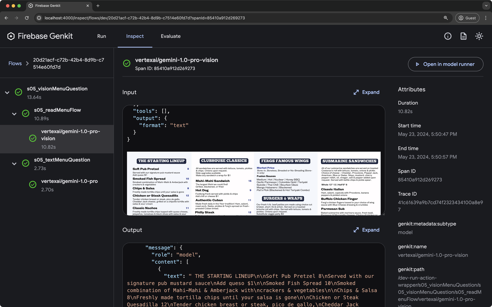

# Genkit Python SDK

Genkit is Google's open-source framework for building full-stack, AI-powered and agentic applications for any platform.

[Documentation](https://genkit.dev/docs/python/get-started/) | [Samples](samples/) | [Discord](https://discord.gg/qXt5zzQKpc) | [Report Issue](https://github.com/genkit-ai/genkit-python/issues)

---

## Quick Start & Core Patterns

Install the SDK and model provider:

```bash
uv add genkit genkit-google-genai genkit-google-cloud genkit-middleware
export GEMINI_API_KEY="your-api-key"
```

### 1. Streaming Generation

```python
from genkit import Genkit
from genkit_google_genai import GoogleAI

ai = Genkit(plugins=[GoogleAI()])

# Stream text responses in real-time
stream = ai.generate_stream(
    model="googleai/gemini-flash-latest",
    prompt="Stream a 2-line poem about space.",
)
async for chunk in stream:
    print(chunk.text, end="")

# Access final response metadata
response = await stream.response
```

### 2. Streaming Tool Calling & Structured Output

```python
from pydantic import BaseModel, Field
from genkit import Genkit
from genkit_google_genai import GoogleAI

ai = Genkit(plugins=[GoogleAI()])

# Define a tool with Pydantic type annotations
class WeatherInput(BaseModel):
    city: str = Field(description="Target city name")

@ai.tool(description="Get current weather for a location")
async def get_weather(input: WeatherInput) -> str:
    return f"Sunny, 72°F in {input.city}"

# Define structured output schema
class ActivityPlan(BaseModel):
    activities: list[str]
    outfit: str

# Stream response with automatic tool execution and structured output
stream = ai.generate_stream(
    model="googleai/gemini-flash-latest",
    prompt="Suggest activities for Seattle today.",
    tools=[get_weather],
    output_schema=ActivityPlan,
)
async for chunk in stream:
    if chunk.text:
        print(chunk.text, end="")

# Access validated Pydantic output object
response = await stream.response
print(response.output)
# => ActivityPlan(activities=['Kayak on Lake Union', 'Discovery Park'], outfit='Light jacket')
```

### 3. Tool Approval Middleware & Restarts

```python
from genkit import Genkit
from genkit_google_genai import GoogleAI
from genkit_middleware import Middleware, ToolApproval

ai = Genkit(plugins=[GoogleAI(), Middleware()])
tool_approval = ToolApproval(allowed_tools=[])

@ai.tool(description="Transfer money to an account")
async def transfer_money(amount: float, to_account: str) -> str:
    return f"Transferred ${amount} to {to_account}"

agent = ai.define_agent(
    name="bankingAgent",
    model="googleai/gemini-flash-latest",
    system="Banking assistant. Call transfer_money when requested.",
    tools=[transfer_money],
    use=[tool_approval],
)

chat = agent.chat()
out1 = await chat.send("Transfer $100 to account 999.")
# => Returns INTERRUPTED status because transfer_money requires approval

# Approve pending tool interrupts and resume execution
restarts = [intr.restart(resumed_metadata={"tool_approved": True}) for intr in out1.interrupts]
out2 = await chat.resume(restart=restarts)
print(out2.text)
# => "$100 has been successfully transferred to account 999."
```

### 4. Agent Loops & Persistent Sessions

```python
from genkit import Genkit
from genkit_google_cloud import FirestoreSessionStore
from genkit_google_genai import GoogleAI

ai = Genkit(plugins=[GoogleAI()])

# Persist multi-turn session history in Cloud Firestore
store = FirestoreSessionStore()

# Define an agent with persistent session memory
agent = ai.define_agent(
    name="supportAgent",
    model="googleai/gemini-flash-latest",
    system="You are a helpful customer support agent.",
    store=store,
)

# Multi-turn chat with automatic persistent session state
chat = agent.chat()
res1 = await chat.send("Hi, my name is Alex.")
res2 = await chat.send("What was my name again?")
print(res2.text)
# => "Your name is Alex!"
```

---

## Key Capabilities

<table>
  <tr>
    <td><strong>Type-Safe by Design</strong></td>
    <td>Leverage native Python type annotations and Pydantic models for structured inputs, outputs, and automatic tool schema generation.</td>
  </tr>
  <tr>
    <td><strong>Unified Model API</strong></td>
    <td>Switch effortlessly between Google Gemini, Anthropic Claude, OpenAI, Ollama, and Vertex AI using a single consistent interface.</td>
  </tr>
  <tr>
    <td><strong>Integrated Observability</strong></td>
    <td>Built-in OpenTelemetry tracing. Inspect execution graphs, token usage, latency, and step inputs/outputs locally in real-time.</td>
  </tr>
  <tr>
    <td><strong>Production Deployment</strong></td>
    <td>Expose flows as standard ASGI/WSGI applications compatible with FastAPI, Flask, Django, Cloud Run, or any serverless platform.</td>
  </tr>
</table>

---

## Developer Tools & Dev UI

Accelerate AI development with the local Genkit Developer UI and CLI.

```bash
genkit start -- uv run main.py
```

Key features:
- **Playground**: Run and experiment with Genkit flows, prompts, and tools in dedicated playgrounds.
- **Trace Inspector**: Analyze detailed execution traces, including step-by-step breakdowns of complex flows.
- **Evaluations**: Review performance metrics and evaluate model outputs over time.



---

## Exploring Samples & Onboarding

Browse runnable, real-world applications in [`samples/`](samples/):

- **[Basic Flows](samples/basic-flows)**: Text generation, structured output, and tool calling
- **[Agentic Workflows](samples/agents)**: Multi-turn agents, session memory, and approval interrupts

### Running Samples Locally

Clone the repository and launch any sample with the interactive Dev UI:

```bash
cd samples/<sample-name>
genkit start -- uv run main.py
```

---

## Local Development

If you're contributing to the Python SDK:

1. **Prerequisites**: Python 3.10+ and [`uv`](https://docs.astral.sh/uv/) (`curl -LsSf https://astral.sh/uv/install.sh | sh`)
2. **Install Dependencies**: `uv sync`
3. **Run Linters & Tests**: `just lint` and `just test`

For coding standards and detailed guidelines, see [CONTRIBUTING.md](CONTRIBUTING.md).

---

## Connect with Us

- [**Follow us on X/Twitter**](https://x.com/GenkitFramework) – News, updates, and tips.
- [**Join us on Reddit**](https://reddit.com/r/GenkitFramework) – Community discussion and Q&A.
- [**Join us on Discord**](https://discord.gg/qXt5zzQKpc) – Get real-time help and chat with developers.
- [**Contribute on GitHub**](https://github.com/genkit-ai/genkit-python/issues) – Report bugs, suggest features, or submit PRs.

## License
Apache 2.0
